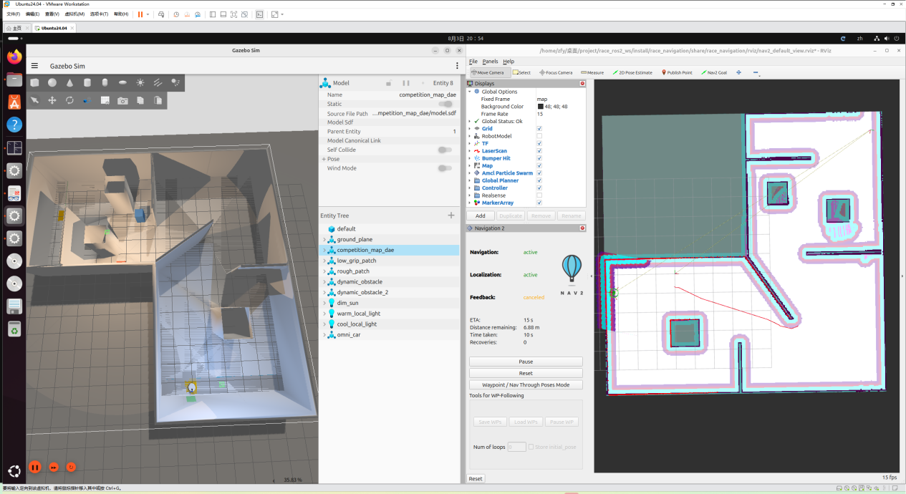
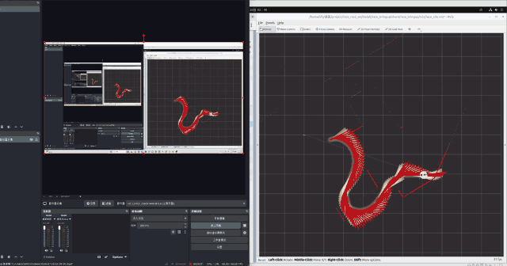
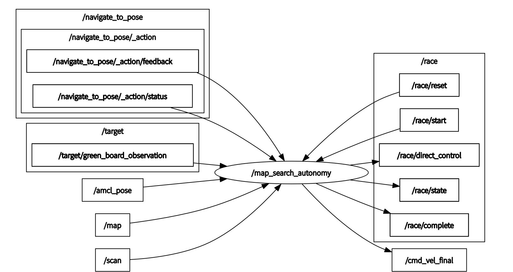
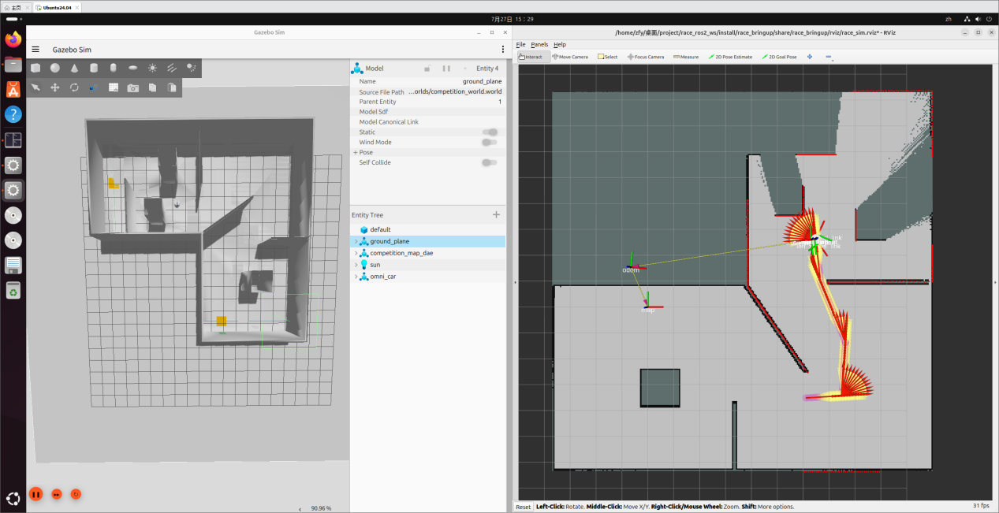
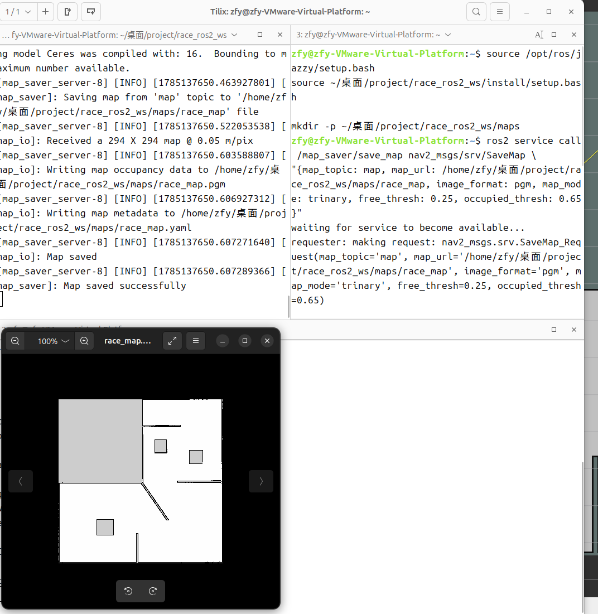
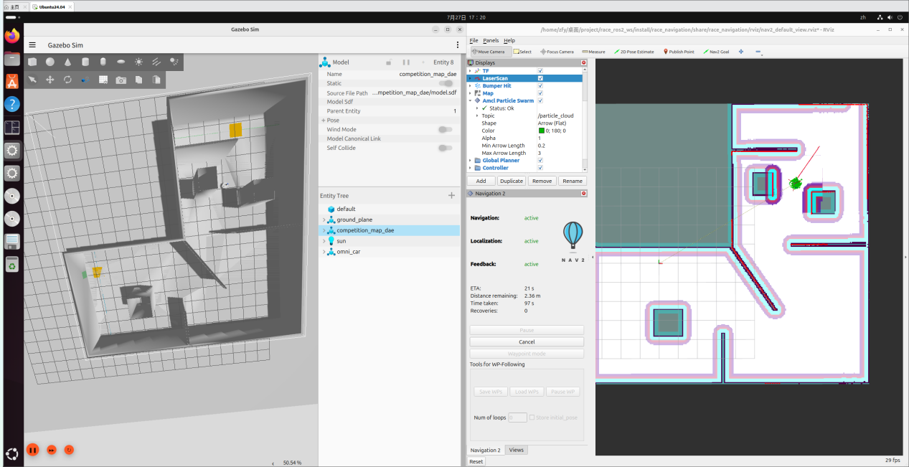
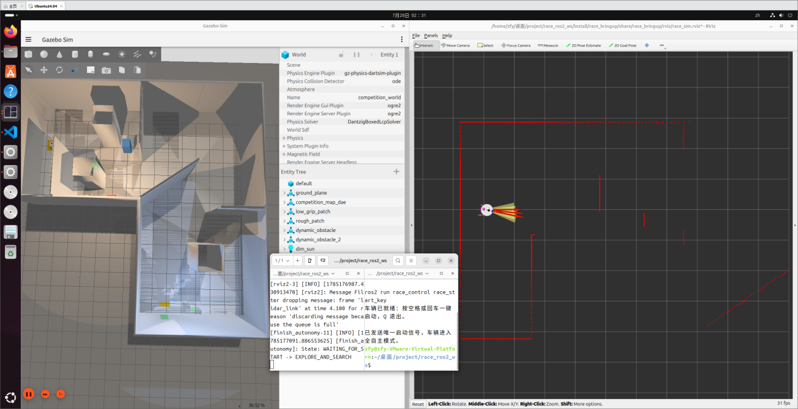
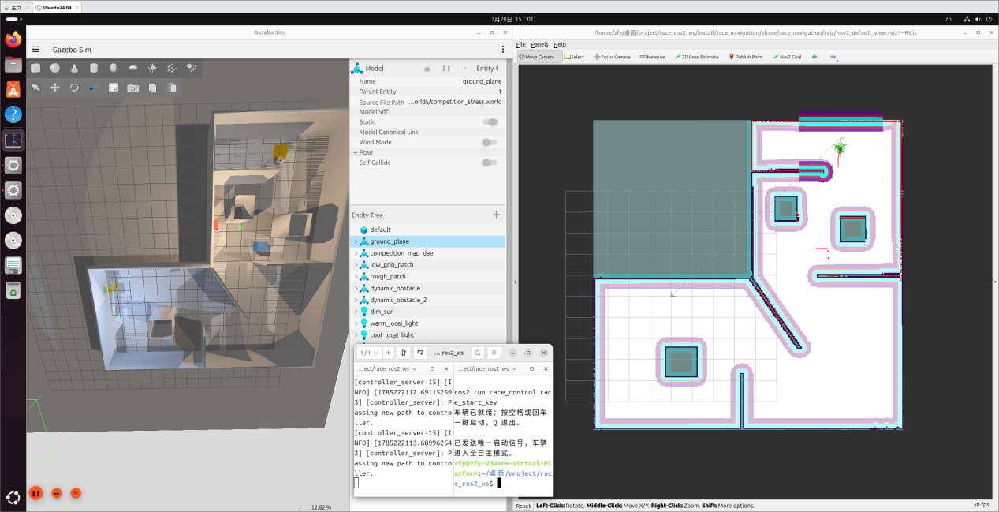
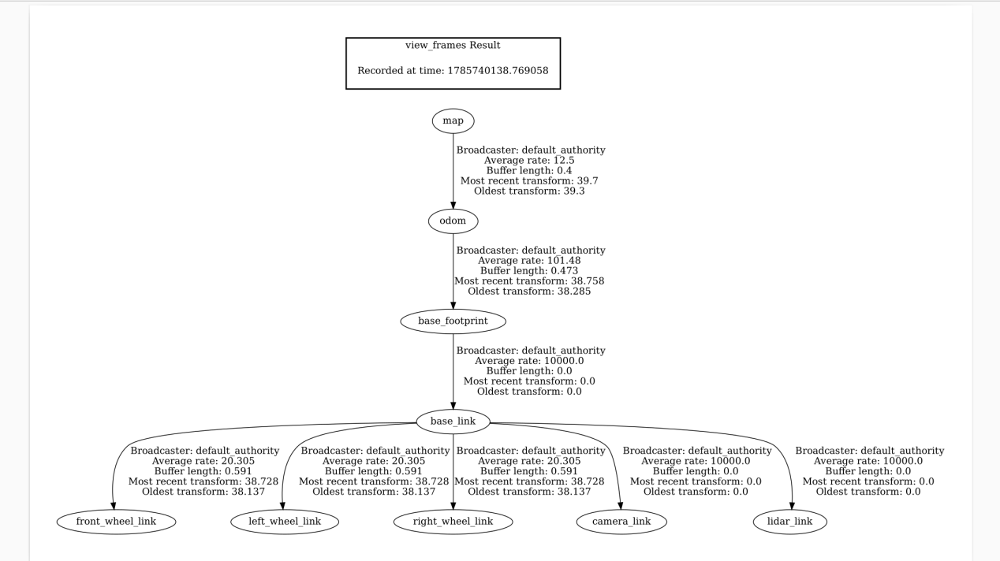

<div align="center">

# Sim2Real-AlgoBench

**A three-wheeled omnidirectional robot autonomy benchmark on ROS 2 Jazzy and Gazebo Sim 8**

One fixed task &nbsp;·&nbsp; one fixed interface contract &nbsp;·&nbsp; one fixed metric set &nbsp;—&nbsp; scored twice: in simulation and on a physical robot

[](https://docs.ros.org/en/jazzy/)
[](https://releases.ubuntu.com/24.04/)
[](https://gazebosim.org/)
[](https://docs.nav2.org/)
[](LICENSE)
[](#algorithm-library)

[The task](#the-task) &nbsp;•&nbsp; [Algorithm library](#algorithm-library) &nbsp;•&nbsp; [Quick start](#quick-start) &nbsp;•&nbsp; [Results](#results) &nbsp;•&nbsp; [Roadmap](#roadmap) &nbsp;•&nbsp; [Troubleshooting](#troubleshooting)

*English &nbsp;|&nbsp; [中文](README.zh-CN.md)*

</div>

---

<p align="center">
  
</p>

<p align="center">
  <em>Fig. 1 — The robot reaches the finish pad after an autonomous search of the saved map. No goal pose was sent by hand and no finish coordinate is hard-coded.</em>
</p>

---

## The task

The robot is placed at a published start pose on a known map and receives exactly one start signal. It must then **autonomously search** the map for a **green A4 marker** on a wall, drive into the **yellow finish pad** in front of it, and hold still for **3 seconds**.

No goal pose is published to Nav2 by hand, and no finish coordinate is hard-coded. The run ends on a **perceptual** condition rather than a geometric one — which is what makes the simulation-to-hardware comparison meaningful, because perception is where the two domains differ most.

## Algorithm library

> **The reason this repository exists.** Global planners are interchangeable: each one is a Nav2 plugin behind a shared interface, and **switching algorithm means editing one number**.

```yaml
# src/algo_bringup/config/algo_registry.yaml
active:
  planner: 1        # >>> change this number to change the algorithm <<<
```

Three layers keep the algorithms independent of ROS, so the same code runs in Gazebo and on the robot:

| Layer | Package | Role |
| :--- | :--- | :--- |
| Algorithms | `algo_core` | Pure C++, **zero ROS dependency**. Offline unit-testable, reusable outside Nav2. |
| Adapters | `algo_nav2_plugins` | One `nav2_core::GlobalPlanner` plugin serving every registered algorithm. |
| Selection | `algo_bringup` | The index, parameter generation, and one behaviour tree per algorithm. |

### Registered algorithms

Measured on the race map (294 × 294 @ 0.05 m), planning from `(-3.0, -5.0)` to `(10.0, 7.0)`:

| Idx | Algorithm | Path | Poses | Note |
| :---: | :--- | :---: | ---: | :--- |
| 0 | Dijkstra | ✅ | 21 | uniform-cost baseline, optimal |
| 1 | **A\*** | ✅ | 23 | octile heuristic, the default |
| 2 | Weighted A\* | ✅ | 29 | greedier, suboptimal, faster |
| 3 | GBFS | ✅ | 22 | fastest to a solution |
| 4 | JPS | ❌ | — | **known defect** — see below |
| 5 | **Theta\*** | ✅ | **8** | any-angle, no grid staircasing |
| 6 | **D\* Lite** | ✅ | 19 | incremental replanning |
| 7 | Nav2 Theta\* | ✅ | 394 | incumbent baseline, for comparison |

Theta\* covers the route in **8 poses against A\*'s 23** — that is any-angle planning removing the staircase, visible as a number.

> **Known defect.** JPS reports `NO_VALID_PATH` on the race map although A\* finds a route under the same cost model, so its pruning is wrong. It passes the synthetic self test, which is why the bug only surfaced on the real map. It is flagged in the registry and **must not be used for reported results**.

### Different algorithms for different situations

All algorithms stay loaded at once, so no algorithm switch costs a restart. Three selection paths:

| Path | Mechanism |
| :--- | :--- |
| **Per request** | `ComputePathToPose` carries a `planner_id` field — pick an algorithm per goal. |
| **Per situation** | `NavigateToPose` has no planner id, but it **does** carry a `behavior_tree` field, so one behaviour tree per algorithm is generated with `planner_id` baked in. |
| **Standalone** | `algo_core::Registry::instance().create("theta_star")` — no ROS node required. |

The situation mapping lives in the same registry:

```yaml
selection:
  stress_world: "P6_d_star_lite"            # moving obstacles -> incremental replanning
  long_range_m: 8.0
  long_range_planner: "P2_weighted_astar"   # long open traversals -> greedier search
  narrow_passage_planner: "P5_theta_star"   # corridors -> any-angle
```

See [`docs/ALGORITHM_PLUGINS.md`](docs/ALGORITHM_PLUGINS.md) for the full guide, including how to add an algorithm in three steps without touching any existing file.

## Demonstration

<p align="center">
  
</p>

<p align="center">
  <em>Fig. 2 — Stress world. Left: Gazebo Sim, with <code>dynamic_obstacle_1</code> and <code>dynamic_obstacle_2</code> in the entity tree. Right: the path Nav2 is replanning as the obstacles move.</em>
</p>

<p align="center">
  The GIF above is a 640 px / 8 fps preview, downscaled so it plays inline.<br/>
  <a href="docs/media/dynamic_obstacle.mp4"><b>⬇ Download the original recording &nbsp;—&nbsp; 1920 × 1080, 60 fps, MP4, 2.5 MB</b></a><br/>
  <sub>Regenerate the preview from the MP4 with <code>python3 tools/make_gif.py</code>.</sub>
</p>

## Features

- Colored SolidWorks competition map converted to Gazebo DAE/SDF models;
- Three-wheeled omnidirectional chassis: URDF/Xacro, wheel joints, LiDAR, camera and `ros2_control`;
- SLAM Toolbox mapping and Nav2 Map Saver for map persistence;
- Prior grid map, published start pose, AMCL online localization;
- Safe search viewpoints generated from the free-space connected component of the start pose;
- Theta\* any-angle global planning, plus seven interchangeable alternatives;
- MPPI `Omni` local control with independent longitudinal, lateral and rotational motion;
- Real-time LiDAR costmap updates handling both static and moving obstacles;
- OpenCV green A4 marker detection;
- On detection, Nav2 is cancelled automatically and the node switches to visual centring, LiDAR ranging and stop;
- `/cmd_vel_nav` and `/cmd_vel_final` arbitration, guaranteeing a **single publisher** on `/cmd_vel`;
- One-button start with space or enter;
- Automatic reporting of task time, first-detection time, path length, collision count and finish offset;
- A nominal world and a stress world with moving obstacles, low-traction regions, rough ground and varying illumination.

## System overview

<p align="center">
  
</p>

```text
saved map + LiDAR + wheel odometry
             │
             ▼
       AMCL (map → odom)
             │
             ▼
 free-space connected-component viewpoint generation
             │ NavigateToPose action
             ▼
   global planner  ──  interchangeable (index 0..7)
             │
             ▼
     MPPI (Omni) local control
             │
             ▼
 velocity_smoother / collision_monitor
             │
             ▼
       /cmd_vel_nav ───────────┐
                               │
 camera → green marker detector │
             │                 │
             ▼                 ▼
 /target/green_board_observation   twist_priority_mux
             │                 ▲
             ▼                 │
   visual centring & approach  │
             │                 │
      /cmd_vel_final ──────────┘
                               │
                               ▼
                           /cmd_vel
                               │
                               ▼
                  Twist → TwistStamped
                               │
                               ▼
                  omni_drive_controller
                               │
                               ▼
                     three wheel joints
```

## Package layout

```text
Sim2Real-AlgoBench/
├── maps/                         # saved race_map.yaml / race_map.pgm
├── reports/                      # auto-generated run reports
├── diagnostics/                  # TF-tree and other diagnostic artefacts
├── docs/                         # figures, media and the algorithm guide
├── tools/                        # make_gif.py — regenerates the demo GIF
└── src/
    ├── algo_core/                # algorithms, no ROS dependency
    ├── algo_nav2_plugins/        # Nav2 plugin adapters
    ├── algo_bringup/             # algorithm index, params, behaviour trees
    ├── race_description/         # URDF, meshes, sensors, ros2_control
    ├── race_gazebo/              # map models, nominal & stress worlds
    ├── race_bringup/             # Gazebo, robot, controllers, bridge, RViz
    ├── race_navigation/          # SLAM, AMCL, Nav2 configuration, launch entry
    ├── race_vision/              # green A4 finish marker detection
    └── race_control/             # one-button start, state machine, mux, metrics
```

| Package | Role |
| :--- | :--- |
| `race_description` | `base_footprint`, `base_link`, three wheels, `lidar_link`, `camera_link`, collision bodies and the Gazebo `ros2_control` hardware interface. |
| `race_gazebo` | Colored competition scene, collision models, nominal world, stress world, low-traction / rough ground, varying illumination, two moving obstacles. |
| `race_bringup` | Starts Gazebo, spawns the robot, loads `joint_state_broadcaster` and `omni_drive_controller`, publishes robot TF, bridges sensors, converts `Twist` to `TwistStamped`. |
| `race_navigation` | SLAM Toolbox, Map Saver, AMCL, Nav2, Theta\*, MPPI Omni, costmaps, velocity smoothing, collision monitoring and `competition.launch.py`. |
| `race_vision` | Detects the green A4 marker using HSV, green excess, CLAHE, morphology and a consecutive-frame test. |
| `race_control` | `map_search_autonomy.py`, `twist_priority_mux.py`, `twist_to_twist_stamped.py`, `race_start_key.py`, `race_metrics.py`, `moving_obstacle.py`. |

## Dependency

| Component | Version / role |
| :--- | :--- |
| OS | Ubuntu 24.04 |
| ROS 2 | Jazzy Jalisco |
| Simulator | Gazebo Sim 8 (Harmonic series) |
| Build | colcon, CMake, ament |
| Navigation | Nav2, AMCL, Theta\*, MPPI Omni |
| Mapping | SLAM Toolbox |
| Control | `ros2_control`, omnidirectional drive controller |
| Vision | OpenCV, `cv_bridge`, `image_transport` |
| Models | URDF/Xacro, STL, DAE, SDF |

## Build

```bash
git clone https://github.com/p20030920p/Sim2Real-AlgoBench.git
cd Sim2Real-AlgoBench

source /opt/ros/jazzy/setup.bash

sudo rosdep init 2>/dev/null || true
rosdep update
rosdep install --from-paths src --ignore-src -r -y

colcon build --symlink-install
source install/setup.bash
```

Add the workspace to every new terminal:

```bash
source /opt/ros/jazzy/setup.bash
source ~/Sim2Real-AlgoBench/install/setup.bash
```

## Quick start

<table>
<tr><th align="left">1 — Launch the full task</th></tr>
<tr><td>

```bash
ros2 launch race_navigation competition.launch.py \
  headless:=false nav_rviz:=true stress:=true
```

`headless:=false` shows Gazebo (required for the perception task); `nav_rviz:=true` opens the Nav2 RViz view for observation; `stress:=true` enables moving obstacles, low-traction ground and varying illumination. Use `stress:=false` for functional checks.

Wait for `Saved-map search autonomy ready; waiting for one-button start.`

</td></tr>
<tr><th align="left">2 — Start with one button</th></tr>
<tr><td>

```bash
ros2 run race_control race_start_key
```

Press **space or enter exactly once**. For scripted runs:

```bash
ros2 topic pub --once /race/start std_msgs/msg/Bool "{data: true}"
```

</td></tr>
<tr><th align="left">3 — Watch the state machine</th></tr>
<tr><td>

```bash
ros2 topic echo /race/state \
  --qos-reliability reliable --qos-durability transient_local
```

`WAITING_FOR_ONE_BUTTON_START` → `PREPARING_MAP_SEARCH` → `NAVIGATING_TO_SEARCH_VIEWPOINT` → `SCANNING_360_FOR_GREEN_BOARD` → `ALIGNING_WITH_GREEN_BOARD` → `APPROACHING_YELLOW_FINISH_PAD` → `HOLDING_STILL_FOR_3_SECONDS` → `COMPLETE`, or `SEARCH_EXHAUSTED`.

</td></tr>
<tr><th align="left">4 — Benchmark the algorithms on their own</th></tr>
<tr><td>

```bash
ros2 launch algo_bringup algo_planner_bench.launch.py
```

Brings up only a map server and a planner server with **every** registered algorithm, so algorithms can be compared on the race map without running the whole scenario. Override the index without editing the file:

```bash
ros2 launch algo_bringup algo_planner_bench.launch.py planner_index:=4
```

</td></tr>
</table>

### Reset

```bash
ros2 topic pub --once /race/reset std_msgs/msg/Bool "{data: true}"
```

Cancels the active goal, publishes zero velocity and returns to the waiting state. To restore the robot to its physical start pose, exit and relaunch the stack.

## Gallery

| SLAM mapping | Map saved |
| :---: | :---: |
|  |  |
| **Nav2 waypoint debug** | **One-button autonomous search** |
|  |  |
| **Stress world** | **TF tree** |
|  |  |

## Re-mapping

When the fixed obstacle layout changes, start the mapping chain:

```bash
ros2 launch race_navigation mapping.launch.py headless:=false rviz:=true
```

In a second terminal, drive the robot around:

```bash
source /opt/ros/jazzy/setup.bash
source ~/Sim2Real-AlgoBench/install/setup.bash
ros2 run teleop_twist_keyboard teleop_twist_keyboard
```

Save once the map is complete:

```bash
mkdir -p ~/Sim2Real-AlgoBench/maps

ros2 service call /map_saver/save_map nav2_msgs/srv/SaveMap \
"{map_topic: map, map_url: $HOME/Sim2Real-AlgoBench/maps/race_map, image_format: pgm, map_mode: trinary, free_thresh: 0.25, occupied_thresh: 0.65}"
```

This produces `maps/race_map.pgm` and `maps/race_map.yaml`.

## Interface reference

| Interface | Type / role |
| :--- | :--- |
| `/race/start` | `std_msgs/Bool` — one-button start |
| `/race/reset` | `std_msgs/Bool` — task reset |
| `/race/state` | `std_msgs/String` — state-machine state |
| `/race/complete` | `std_msgs/Bool` — completion flag |
| `/race/direct_control` | velocity-arbitration selection signal |
| `/map` | `nav_msgs/OccupancyGrid` — static map |
| `/scan` | `sensor_msgs/LaserScan` |
| `/amcl_pose` | AMCL pose estimate |
| `/camera/image_raw` | raw camera image |
| `/target/green_board_observation` | green marker detection result |
| `/navigate_to_pose` | Nav2 navigation action |
| `/compute_path_to_pose` | Nav2 planning action — carries `planner_id` |
| `/cmd_vel_nav` | Nav2 velocity command |
| `/cmd_vel_final` | visual-servoing velocity command |
| `/cmd_vel` | arbitrated chassis command — **single publisher** |
| `/omni_drive_controller/cmd_vel` | `TwistStamped` controller input |
| `/omni_drive_controller/odom` | omnidirectional controller odometry |
| `/tf`, `/tf_static` | dynamic and static transforms |

### TF tree

<p align="center">
  
</p>

```text
map
└── odom
    └── base_footprint
        └── base_link
            ├── lidar_link
            ├── camera_link
            ├── front_wheel_link
            ├── left_wheel_link
            └── right_wheel_link
```

AMCL publishes `map → odom`; the omnidirectional controller publishes `odom → base_footprint`; `robot_state_publisher` publishes the body transforms from the URDF and `/joint_states`.

## Parameters

| Parameter | Value |
| :--- | :--- |
| MPPI Omni | `vx_max = 0.90 m/s`, `vy_max = 0.65 m/s`, `wz_max = 1.30 rad/s` |
| Terminal visual approach | up to ≈0.46 m/s |
| Search viewpoints | ≈1.0 m spacing, 0.65 m obstacle clearance, ≤8 viewpoints |
| Search time limit | ≈285 s, then `SEARCH_EXHAUSTED` |
| Terminal barrier distance | ≈0.34 m |
| Completion criterion | finish conditions satisfied and 3 s stationary |

## Results

One complete nominal-world run of the baseline, kept as a regression reference:

| Metric | Value |
| :--- | :--- |
| Outcome | `COMPLETE` |
| Completion time | 90.917 s |
| First marker detection | 63.033 s |
| Path length | 31.303 m |
| Collisions | 0 |
| Terminal wall clearance | 0.3658 m |
| Marker horizontal error | −0.0134 |

> This is a **single run** under the simulation parameters and machine of the time. It is a regression baseline, not a reportable benchmark result. Per-run records are written to `reports/` as `*.json` plus a readable `*.md`, with `reports/race_summary.csv` across runs.

## Roadmap

`[x]` = baseline in place, `[ ]` = open.

**Baseline**

- [x] Mapping — SLAM Toolbox
- [x] Localization — AMCL
- [x] Global planning — Theta\* + 7 interchangeable alternatives
- [x] Local control — MPPI, `Omni` motion model
- [x] Perception — HSV + green-excess threshold detector

**Planners**

- [x] Dijkstra, A\*, Weighted A\*, GBFS, Theta\*, D\* Lite
- [ ] JPS — implemented but **broken on the race map**, needs debugging
- [ ] RRT, RRT\*, Informed RRT\*, RRT-Connect
- [ ] Hybrid A\*, Voronoi, ACO, GA, PSO

**Controllers**

- [ ] DWA, APF, RPP, PID, LQR, MPC — the adapter layer is not written yet
- [ ] Multiple controllers selectable per goal via `controller_id`

**Physical track**

- [ ] Hardware bring-up and calibration record
- [ ] Mapping / localization / planning / control / perception on the robot

## Adding a new algorithm

**Read this before opening a pull request.** The point of this repository is that an algorithm can be swapped in *one* category while every other category keeps its baseline implementation, so results stay comparable.

1. **Pick one category** — mapping, localization, global planning, local control, perception or mission logic.
2. **Satisfy that category's interface.** For a planner, implement `algo_core::GridPlanner` and self-register:

   ```cpp
   class MyPlanner final : public algo_core::GridPlanner {
   public:
     std::string name() const override { return "my_planner"; }
     algo_core::PlanResult plan(const algo_core::CostGrid & grid,
                                const algo_core::Pose2D & start,
                                const algo_core::Pose2D & goal) override;
   };
   ALGO_CORE_REGISTER(algo_core::MyPlanner, "my_planner")
   ```

3. **Add one entry to `algo_registry.yaml`** — the plugin class and behaviour trees are generated, so nothing else changes.
4. **Never publish to `/cmd_vel` directly.** Write to `/cmd_vel_nav` or `/cmd_vel_final`; the mux arbitrates. One publisher on `/cmd_vel` is a contract, not a detail.
5. **Do not modify the baseline packages** to make a contribution work. If that seems necessary, the interface is wrong — please open an issue instead.
6. **Report the same metrics** as the baseline (`race_metrics`) and state any protocol deviation.

## Troubleshooting

**`/cmd_vel` publishes at a normal rate but the robot does not move.**
`ros2 topic hz` only proves messages are flowing. Check the values and the controller state:

```bash
ros2 topic echo /cmd_vel
ros2 topic echo /omni_drive_controller/cmd_vel
ros2 control list_controllers
```

**RViz reports TF or message-queue errors.**
Check that every node is on simulation time, and set RViz `Fixed Frame` to `map`:

```bash
ros2 topic hz /clock
ros2 run tf2_ros tf2_echo map base_footprint
```

**A planner reports `NO_VALID_PATH` (error 208) but the map looks fine.**
Check `lethal_threshold`: the default `253` treats Nav2's inscribed-inflation cells as obstacles, which can close narrow passages. Lower it to `254` in the registry entry to plan through inflated cells.

**Nav2 keeps recovering in front of a moving obstacle.**
In the stress world a moving obstacle can transiently block a narrow passage. The autonomy node re-targets and starts another search round; it only enters `SEARCH_EXHAUSTED` near the 285 s limit.

**The green marker is not detected.**

```bash
ros2 topic hz /camera/image_raw
ros2 topic echo /target/green_board_observation
```

Vision thresholds must be re-calibrated for exposure, white balance, ambient light and actual distance on a physical robot.

### Diagnostics

```bash
ros2 node list
ros2 node info /map_search_autonomy
ros2 topic list -t
ros2 topic info /cmd_vel -v
ros2 action info /navigate_to_pose
ros2 control list_hardware_interfaces
rqt_graph                       # use "Nodes/Topics (active)"

mkdir -p diagnostics && cd diagnostics
ros2 run tf2_tools view_frames
```

`omni_drive_controller` and `joint_state_broadcaster` should both be `active`.

## Before running on a physical robot

A passing simulation does **not** license high-speed hardware operation. The first physical runs must be done at reduced speed, in an open area, with an immediate emergency stop available, and every item below calibrated step by step:

- published start pose `x / y / yaw`;
- actual wheel radius, wheel mounting angles, wheel rotation directions and maximum stable speed;
- LiDAR and camera extrinsic offsets from `base_link`;
- camera exposure, white balance and the green threshold under venue illumination;
- robot footprint, finish-pad coverage ratio and barrier stopping distance;
- chassis hardware interface, serial/CAN and emergency stop;
- collision geometry, floor friction, braking distance and speed cap.

**The algorithm plugins need no changes for the robot.** They emit standard `geometry_msgs/Twist` including `linear.y`, so the existing chain (`/cmd_vel` → `TwistStamped` → `omni_drive_controller`) is untouched. Two things to watch: enable lateral velocity in `controller_server` (`min_y_velocity_threshold`), and re-tune the costmap inflation radius for real sensor noise.

## Acknowledgement

The simulation, the baseline implementation and the original Chinese documentation were developed by [zfyyyyy](https://github.com/zfyyyyy). This repository builds on the ROS 2, Nav2, SLAM Toolbox, Gazebo and OpenCV ecosystems.

If you use this work, please cite the underlying packages:

- S. Macenski, F. Martín, R. White, J. Clavero. *The Marathon 2: A Navigation System.* IROS, 2020.
- S. Macenski, I. Jambrecic. *SLAM Toolbox: SLAM for the dynamic world.* JOSS, 6(61): 2783, 2021.
- K. Daniel, A. Nash, S. Koenig, A. Felner. *Theta-star: Any-Angle Path Planning on Grids.* JAIR, 39: 533–579, 2010.
- G. Williams, N. Wagener, B. Goldfain, P. Drews, J. M. Rehg, B. Boots, E. A. Theodorou. *Information Theoretic MPC for Model-Based Reinforcement Learning.* ICRA, 2017.

## License

[MIT](LICENSE).
