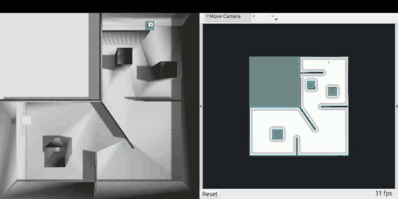
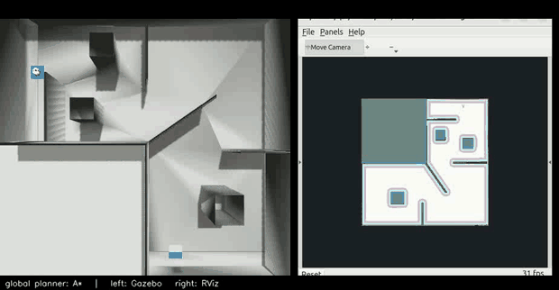
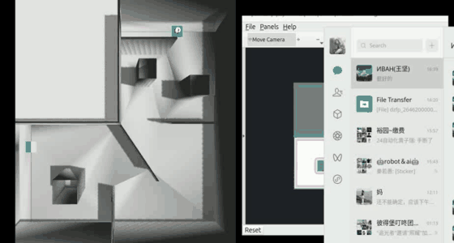
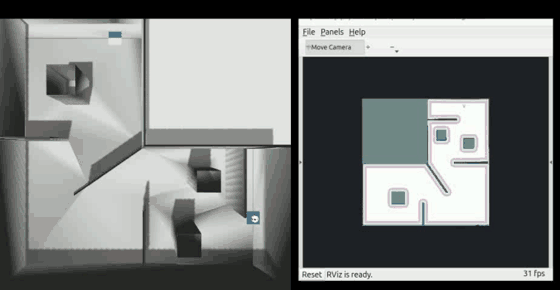
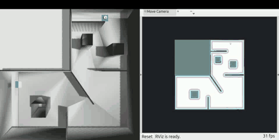
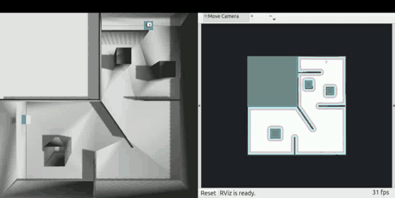
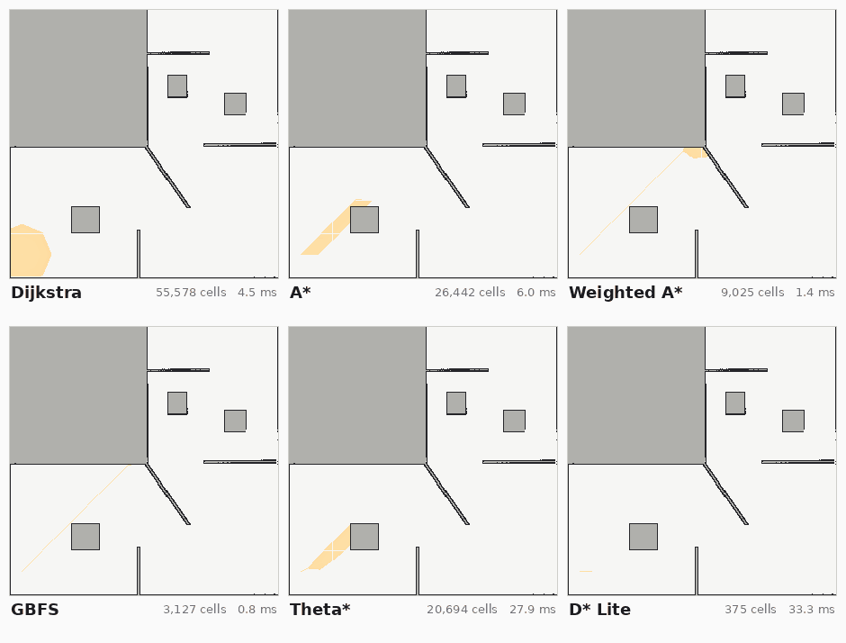

<div align="center">

# Sim2Real-AlgoBench

**A three-wheeled omnidirectional robot autonomy benchmark — one task, one interface contract, one metric set, scored in simulation and on hardware.**

[](https://docs.ros.org/en/jazzy/)
[](https://gazebosim.org/)
[](LICENSE)
[](#algorithm-library)

[Task](#the-task) &nbsp;•&nbsp; [Algorithm library](#algorithm-library) &nbsp;•&nbsp; [Demos](#demos) &nbsp;•&nbsp; [Quick start](#quick-start) &nbsp;•&nbsp; [Docs](#docs)

*English &nbsp;|&nbsp; [中文](README.zh-CN.md)*

</div>

<p align="center">
  
</p>

<p align="center">
  <em>Autonomous search of the saved map, green-marker detection, finish-pad approach. No goal pose is sent by hand.</em>
</p>

## The task

The robot is given a start pose and one start signal. It searches a known map for a green A4 marker on a wall, drives onto the yellow pad in front of the marker, and stays still for 3 seconds.

The run ends when the marker is detected, not when a coordinate is reached. Perception is therefore on the critical path in both domains, which is what makes the simulation-to-hardware comparison worth running.

## Algorithm library

The global planner is a Nav2 plugin, and seven implementations are interchangeable. The active one is chosen by one line:

```yaml
# src/algo_bringup/config/algo_registry.yaml
active:
  planner: 1
```

The algorithms live in `algo_core`, which has no ROS dependency and can be unit tested on its own. `algo_nav2_plugins` wraps them behind a single `nav2_core::GlobalPlanner` adapter. `algo_bringup` holds the index, the parameters and the behaviour trees.

Measured on the race map (294 × 294 at 0.05 m), planning from `(-3.0, -5.0)` to `(10.0, 7.0)`:

| Idx | Algorithm | Path | Poses | Cells expanded | Time |
| :---: | :--- | :---: | ---: | ---: | ---: |
| 0 | Dijkstra | yes | 21 | 55,578 | 5.0 ms |
| 1 | **A\*** | yes | 23 | 26,442 | 5.3 ms |
| 2 | Weighted A\* | yes | 29 | 9,025 | 1.4 ms |
| 3 | GBFS | yes | 22 | 3,127 | 0.6 ms |
| 4 | JPS | **no** | — | 5 | 0.1 ms |
| 5 | **Theta\*** | yes | **8** | 20,694 | 30.5 ms |
| 6 | **D\* Lite** | yes | 19 | 375 | 38.7 ms |
| 7 | Nav2 Theta\* | yes | 394 | — | — |

A\* expands 26,442 cells; D\* Lite expands 375, because it keeps its search between calls and only repairs what changed. Theta\* returns 8 poses where A\* returns 23; the difference is the grid staircase that any-angle planning removes.

All registered planners stay loaded at once, and any of them can be selected per request:

| Selection | Mechanism |
| :--- | :--- |
| Per request | `ComputePathToPose` carries a `planner_id` field |
| Per situation | one behaviour tree per algorithm, chosen through `behavior_tree` |
| Outside Nav2 | `algo_core::Registry::instance().create("theta_star")` |

JPS is registered but does not work. It returns `NO_VALID_PATH` on the race map where A\* finds a route with the same cost model, so its pruning is incorrect. Do not use it for reported results.

## Demos

### The task, with the planner's plan beside it

Gazebo on the left, RViz on the right, one complete run from the start signal to
the 3-second hold. The left half is the simulator's own top-down camera, with no
overlay at all; the right half is RViz drawing the same moment from the same
topics — the saved map, the global costmap, the live LiDAR scan, the planned
path in red, and the robot model. Nothing is composited or re-timed: both halves
come from one run, and the state in the header comes from `/race/state`.

The two halves have to be turned to the same angle or the comparison is
worthless, and the top camera's image axes are not the world axes the map, the
path and RViz use. A 1.2 m marker was placed at a known world point, one at a
time, and located by differencing the camera frame against the frame before it,
so nothing is inferred from colour or from what looks plausible:

| marker, 3 m from the camera in | offset from image centre |
| :--- | :--- |
| world **+X** | ( −0.5, −82.1) — image up |
| world **−X** | ( −9.0, +81.5) — image down |
| world **+Y** | (−82.5, +8.0) — image left |

The camera hangs over the arena centre, which is image (240, 240). 82 px for
3 m is 27.4 px/m against 27.2 predicted from the camera height and field of
view, so the measurement is sound, and the three points agree with each other.

World +X is therefore image up and world +Y is image left, which is a quarter
turn away from the orientation the map and RViz are drawn in. Rotating the
camera half 90° clockwise puts +X right and +Y up. Checked a second way: the car
sits at the known pose (8.0727, 7.5312) during the test, which that orientation
places at (361, 61), and it is measured at (359.5, 62.2) — about 2 px out.

```bash
tools/record_all_planners.sh /tmp/planners        # every registered planner
```

The point of showing both is that neither half is sufficient alone. Gazebo shows
what the robot did; RViz shows what the navigation stack believed, and the path
it committed to. When they disagree, that is the interesting case.

Every registered planner, same task, same everything else:

| Global planner | Outcome | Driven | Clip |
| :--- | :---: | ---: | :---: |
| **Weighted A\*** | `COMPLETE` | 29.7 m |  |
| **A\*** | `COMPLETE` | 36.5 m |  |
| **Dijkstra** | `COMPLETE` | 40.8 m |  |
| **GBFS** | `COMPLETE` | 40.5 m |  |
| **D\* Lite** | `COMPLETE` | 58.7 m |  |
| **Theta\*** | `COMPLETE` | 149.0 m |  |
| **JPS** | `COMPLETE` | 102.0 m |  |

All seven complete the task, which is the honest result and also a warning about
reading too much into a single number. The distance driven is not the planner's
path quality: it counts every replan and every viewpoint revisit the mission
asked for, and Theta\*'s 149 m is that, not a bad path. These clips are for
seeing the behaviour, not for ranking the algorithms — the offline table above,
measured on one planning call, is the ranking.

The clips are MP4 at `docs/media/run_sidebyside/<algorithm>.mp4`. To reproduce
one run directly:

```bash
export GZ_SIM_SYSTEM_PLUGIN_PATH=/opt/ros/jazzy/lib
ros2 launch race_navigation competition.launch.py headless:=true stress:=false
python3 tools/send_start_signal.py        # the one start signal
ros2 topic echo /race/state               # watch it finish
```

### Search shape, and how to read the colours

`docs/media/search_2d.gif` animates the order in which each planner expanded
cells, from `algo_plan_dump`'s record of the real searches. The colour is
**expansion order, normalised per panel**: the first cell a planner expanded is
pale yellow, the last is saturated orange.

Normalised per panel is what makes this figure easy to misread, so it is worth
being explicit: orange in the Dijkstra panel is roughly expansion 55,000, and
orange in the D\* Lite panel is roughly expansion 375. Two panels of the same
colour are at the same *fraction* of their own search, not at the same amount of
work. To compare how much work each planner did, read the cell count printed
under each panel, not the colour — A\* expands 26,442 cells against D\* Lite's
375, which is the entire reason the incremental planner exists.



<p align="center">
  <sub><a href="docs/media/search_2d.mp4">Download (MP4)</a> &nbsp;·&nbsp; rendered with <code>tools/render_planning_demo.py</code></sub>
</p>

### Stress world

The race scenario running: Gazebo on the left, RViz on the right. This is the stress world, which adds low-traction and rough-ground patches and two moving obstacles to the arena.

<p align="center">
  
</p>

<p align="center">
  <sub><a href="docs/media/dynamic_obstacle.mp4">Download the original (MP4, 1920 × 1080 at 60 fps)</a> &nbsp;·&nbsp; regenerate with <code>python3 tools/make_gif.py</code></sub>
</p>

## Gallery

| SLAM mapping | Map saved |
| :---: | :---: |
|  |  |
| **Stress world** | **TF tree** |
|  |  |

## Quick start

```bash
git clone https://github.com/p20030920p/Sim2Real-AlgoBench.git
cd Sim2Real-AlgoBench
source /opt/ros/jazzy/setup.bash
rosdep install --from-paths src --ignore-src -r -y
colcon build --symlink-install && source install/setup.bash
```

Run the full task:

```bash
ros2 launch race_navigation competition.launch.py headless:=false stress:=true
ros2 run race_control race_start_key          # press space or enter once
ros2 topic echo /race/state                   # observe the state machine
```

Run the planners alone, without the scenario. Every registered algorithm is loaded, and `planner_index` selects which one the terminal table reports as active:

```bash
ros2 launch algo_bringup algo_planner_bench.launch.py planner_index:=4
```

## Results

One baseline run in the nominal world, kept as a regression reference:

| Outcome | Time | First detection | Path | Collisions | Wall clearance |
| :---: | ---: | ---: | ---: | ---: | ---: |
| `COMPLETE` | 90.917 s | 63.033 s | 31.303 m | 0 | 0.3658 m |

This is a single run on the machine of the time, not a benchmark result. Each run is written to `reports/` as a JSON file and a readable summary.

The recorded demo above is a separate run of the same stack (`COMPLETE`, 101.295 s, 27.059 m, 0 collisions); its own report is in `reports/`.

## Layout

```text
src/
├── algo_core/            # algorithms, no ROS dependency
├── algo_nav2_plugins/    # Nav2 plugin adapters
├── algo_bringup/         # algorithm index, parameters, behaviour trees
├── race_description/     # URDF, meshes, sensors, ros2_control
├── race_gazebo/          # competition map, nominal and stress worlds
├── race_bringup/         # Gazebo, robot, controllers, bridge, RViz
├── race_navigation/      # SLAM, AMCL, Nav2 configuration, launch entry
├── race_vision/          # green A4 marker detection
└── race_control/         # one-button start, state machine, mux, metrics
```

## Docs

| Document | Contents |
| :--- | :--- |
| [`docs/ALGORITHM_PLUGINS.md`](docs/ALGORITHM_PLUGINS.md) | Adding an algorithm, the selection mechanism, simulation and hardware use |
| [`tools/make_gif.py`](tools/make_gif.py) | Converts a screen recording into the GIFs above |
| [`tools/render_planning_demo.py`](tools/render_planning_demo.py) | Renders the planning comparison from `algo_plan_dump` output |

### Adding an algorithm

1. Write a subclass of `algo_core::GridPlanner`.
2. Register it with `ALGO_CORE_REGISTER`.
3. Add an entry to `algo_registry.yaml`.

The Nav2 plugin and the behaviour trees are generated from the registry, so no other file needs to change.

### Velocity output

A planner returns a path; it does not command the base. Velocity is published on `/cmd_vel_nav` or `/cmd_vel_final`, and `twist_priority_mux` selects one of the two to publish on `/cmd_vel`.

### Running on the robot

The plugins publish standard `geometry_msgs/Twist` including `linear.y`, so the same binary runs in Gazebo and on the vehicle. Two settings change: `min_y_velocity_threshold` in `controller_server` must allow lateral motion, and the costmap inflation radius needs re-tuning for the real LiDAR.

## Roadmap

- [x] Baseline: SLAM Toolbox, AMCL, Theta\*, MPPI Omni, HSV marker detection
- [x] Interchangeable planners: Dijkstra, A\*, Weighted A\*, GBFS, Theta\*, D\* Lite
- [ ] JPS: implement the pruning correctly
- [ ] Sampling planners: RRT, RRT\*, Informed RRT\*, RRT-Connect
- [ ] Controller adapters: DWA, APF, RPP, LQR, MPC
- [ ] Hardware bring-up and calibration record

## Acknowledgement

The simulation, the baseline and the original Chinese documentation were written by [zfyyyyy](https://github.com/zfyyyyy). This repository uses ROS 2, Nav2, SLAM Toolbox, Gazebo and OpenCV.

If you use this work, please cite Nav2 ([Marathon 2, IROS 2020](https://arxiv.org/abs/2003.00368)), SLAM Toolbox ([JOSS 6(61):2783, 2021](https://joss.theoj.org/papers/10.21105/joss.02783)) and Theta\* ([JAIR 39:533–579, 2010](https://www.jair.org/index.php/jair/article/view/10676)).

## License

[MIT](LICENSE).
